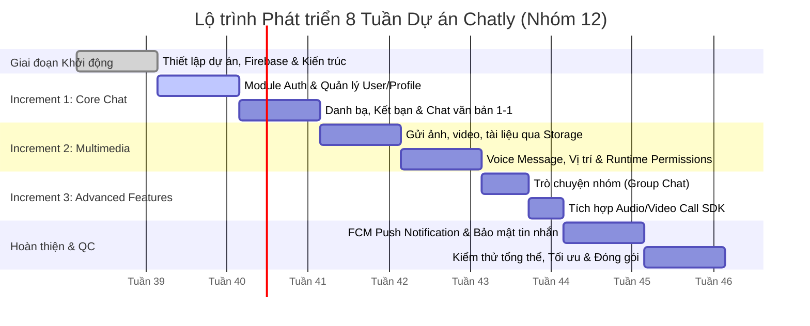

# **Kế Hoạch Chi Tiết Dự Án: Chatly - Ứng Dụng Giao Tiếp Trực Tuyến Đa Phương Tiện**

> **Môn học:** Phát triển ứng dụng trên thiết bị di động (NT118)  
> **Nhóm thực hiện:** Nhóm 12  
> **Mô hình phát triển:** Incremental Model (Phát triển lũy tiến qua 8 tuần)  
> **Ngôn ngữ & Nền tảng:** Java (Android SDK), Firebase BaaS (Auth, Firestore, Storage, Cloud Messaging), Call SDK (ZegoCloud / Agora / WebRTC)

---

## **1. Tổng quan Dự án & Mục tiêu**

### **1.1. Tầm nhìn sản phẩm (Product Vision)**
**Chatly** là ứng dụng nhắn tin và gọi điện đa phương tiện dành cho hệ điều hành Android, được xây dựng hoàn toàn bằng ngôn ngữ **Java**. Ứng dụng hướng tới trải nghiệm người dùng mượt mà, tức thời (real-time), an toàn và giàu tính năng từ nhắn tin văn bản, chia sẻ hình ảnh/video/tài liệu, tin nhắn thoại (voice message), chia sẻ vị trí cho đến gọi thoại/video chất lượng cao và trò chuyện nhóm.

### **1.2. Mục tiêu kỹ thuật**
* **Kiến trúc:** Triển khai theo mô hình **MVVM (Model-View-ViewModel)** hoặc **Repository Pattern** chuẩn Android nhằm phân tách rõ ràng giữa UI, Business Logic và Data Layer.
* **Thời gian thực:** Khai thác tối đa sức mạnh của **Firebase Firestore Realtime Listeners** và **FCM**.
* **Đa phương tiện:** Tích hợp mượt mà **CameraX**, **MediaRecorder/MediaPlayer**, **Android Location Services**.
* **Đồng bộ & Hiệu năng:** Tối ưu hóa bộ nhớ đệm hình ảnh (Glide), RecyclerView pagination/caching, xử lý tiến trình ngầm (Foreground Service, WorkManager, ExecutorService).

---

## **2. Kiến trúc Ứng dụng & Cấu trúc Thư mục Dự kiến**

### **2.1. Sơ đồ Kiến trúc Tổng thể (MVVM Architecture)**

```
┌──────────────────────────────────────────────────────────────┐
│                        VIEW LAYER                            │
│  - Activities (AuthActivity, MainActivity, ChatActivity...)  │
│  - Fragments (ChatsFragment, ContactsFragment, Profile...)   │
│  - Custom Views, ViewHolders, RecyclerView Adapters          │
└──────────────────────────────┬───────────────────────────────┘
                               │ Observes LiveData / State
                               ▼
┌──────────────────────────────────────────────────────────────┐
│                     VIEWMODEL LAYER                          │
│  - AuthViewModel, ChatViewModel, ContactViewModel...         │
│  - Handles UI business logic, exposes LiveData/Observable    │
└──────────────────────────────┬───────────────────────────────┘
                               │ Calls methods
                               ▼
┌──────────────────────────────────────────────────────────────┐
│                    REPOSITORY LAYER                          │
│  - AuthRepository, ChatRepository, UserRepository...         │
│  - Single source of truth: Mediates between Remote & Local   │
└──────────────────────────────┬───────────────────────────────┘
                               │
               ┌───────────────┴───────────────┐
               ▼                               ▼
┌──────────────────────────────┐ ┌─────────────────────────────┐
│      REMOTE DATA SOURCE      │ │      LOCAL DATA SOURCE      │
│ - Firebase Authentication    │ │ - Room Database / SQLite    │
│ - Cloud Firestore            │ │ - EncryptedSharedPreferences│
│ - Firebase Storage           │ │ - Internal Storage / Cache  │
│ - Firebase Cloud Messaging   │ └─────────────────────────────┘
│ - Third-party Call SDK       │
└──────────────────────────────┘
```

### **2.2. Cấu trúc thư mục mã nguồn (Package Structure)**

```
com.group12.chatly/
├── data/
│   ├── model/                  # Data classes / Entities (User, Message, Chat, CallLog...)
│   ├── remote/                 # Firebase Service Wrappers, API Clients
│   └── repository/             # Concrete Repository implementations
├── ui/
│   ├── auth/                   # LoginActivity, RegisterActivity, ForgotPasswordActivity
│   ├── main/                   # MainActivity, Tabs (Chats, Contacts, Calls, Settings)
│   ├── chat/                   # DirectChatActivity, GroupChatActivity, Adapters, ViewHolders
│   ├── contact/                # AddFriendActivity, SearchUserActivity, ContactListFragment
│   ├── media/                  # ImageViewerActivity, VideoPlayerActivity, CameraActivity
│   ├── call/                   # AudioCallActivity, VideoCallActivity
│   └── profile/                # ProfileActivity, EditProfileActivity, SecuritySettingsActivity
├── viewmodel/                  # Android ViewModels (AuthViewModel, ChatViewModel...)
├── service/                    # FCMService, CallKeepService, AudioRecordService
├── utils/                      # Constants, DateFormatter, PermissionHelper, FileUtils, AESCrypto
└── ChatlyApplication.java       # Custom Application class (Firebase init, SDK setup)
```

---

## **3. Thiết kế Cơ sở Dữ liệu (Cloud Firestore Data Model)**

### **3.1. Collection: `users`**
```json
{
  "userId": "string (Firebase Auth UID)",
  "displayName": "string",
  "email": "string",
  "phoneNumber": "string",
  "avatarUrl": "string",
  "bio": "string",
  "isOnline": "boolean",
  "lastSeen": "timestamp",
  "fcmToken": "string",
  "createdAt": "timestamp"
}
```

### **3.2. Collection: `chats`**
```json
{
  "chatId": "string (UUID or composite)",
  "type": "string ('DIRECT' | 'GROUP')",
  "name": "string (Tên nhóm nếu là group)",
  "avatarUrl": "string (Ảnh nhóm nếu là group)",
  "members": ["userId1", "userId2"],
  "memberDetails": {
    "userId1": { "role": "ADMIN", "joinedAt": "timestamp" }
  },
  "lastMessage": {
    "senderId": "string",
    "text": "string",
    "type": "string ('TEXT' | 'IMAGE' | 'VOICE' | 'VIDEO' | 'FILE' | 'LOCATION')",
    "timestamp": "timestamp",
    "isReadBy": ["userId1"]
  },
  "updatedAt": "timestamp"
}
```

### **3.3. Sub-collection: `chats/{chatId}/messages`**
```json
{
  "messageId": "string (Auto ID)",
  "senderId": "string",
  "senderName": "string",
  "senderAvatar": "string",
  "type": "string ('TEXT' | 'IMAGE' | 'VOICE' | 'VIDEO' | 'FILE' | 'LOCATION')",
  "content": "string (Nội dung text hoặc URL tệp hoặc Tọa độ lat,lng)",
  "fileMetaData": {
    "fileName": "string",
    "fileSize": "long",
    "duration": "int (giây, áp dụng cho voice/video)",
    "mimeType": "string"
  },
  "readBy": ["userId1", "userId2"],
  "createdAt": "timestamp",
  "isDeleted": "boolean"
}
```

### **3.4. Collection: `friendships` / `contacts`**
```json
{
  "friendshipId": "string",
  "requesterId": "string",
  "receiverId": "string",
  "status": "string ('PENDING' | 'ACCEPTED' | 'BLOCKED')",
  "createdAt": "timestamp",
  "updatedAt": "timestamp"
}
```

---

## **4. Lộ Trình & Kế Hoạch 8 Tuần Chi Tiết Theo Incremental Model**



---

### **Tuần 1: Khởi Động - Kiến Trúc & Thiết Lập Nền Tảng**
* **Mục tiêu:** Hoàn thiện bộ khung dự án, kết nối Firebase, chuẩn hóa Git Flow và thống nhất các giao thức dữ liệu.
* **Nhiệm vụ cụ thể theo nhân sự:**
  * **Backend & Data Lead:**
    * Tạo Firebase Project trên Firebase Console (Bật Auth, Firestore, Storage, Cloud Messaging).
    * Tải và tích hợp file `google-services.json` vào Android project.
    * Viết các rules bảo mật ban đầu (`firestore.rules`, `storage.rules`).
    * Tạo lớp `FirebaseManager` singleton / Dependency Injection cơ bản.
  * **UI/UX & Chat Lead:**
    * Khởi tạo dự án Android Studio (Java, Min SDK 24, Target SDK 34).
    * Thiết lập `res/values/colors.xml`, `themes.xml`, `typography.xml` chuẩn phong cách hiện đại.
    * Tạo cấu trúc package MVVM, BaseActivity, BaseFragment.
    * Thiết lập Navigation Component hoặc BottomNavigationView cho MainActivity.
  * **Multimedia Lead:**
    * Khảo sát và lựa chọn Third-party Call SDK (ZegoCloud / Agora RTC).
    * Cấu hình các thư viện Gradle cần thiết (Glide, CircleImageView, Lottie, Material Components).
    * Viết tài liệu tổng hợp các Runtime Permission bắt buộc (Camera, Record Audio, Read/Write Storage, Fine Location).

---

### **Tuần 2 & 3: Increment 1 - Xác Thực Người Dùng & Giao Tiếp Cơ Bản**
* **Mục tiêu:** Người dùng có thể đăng ký, đăng nhập, tìm bạn bè và nhắn tin văn bản thời gian thực 1-1 kèm trạng thái tin nhắn.
* **Nhiệm vụ cụ thể theo nhân sự:**
  * **Backend & Data Lead:**
    * Xây dựng `AuthRepository`: `signUp()`, `signIn()`, `signOut()`, `resetPassword()`.
    * Xây dựng `UserRepository`: CRUD thông tin cá nhân, cập nhật status (Online/Offline, lastSeen).
    * Xây dựng `ChatRepository`: Lắng nghe tin nhắn mới (`SnapshotListener`), gửi tin nhắn văn bản, cập nhật trạng thái `isReadBy`.
  * **UI/UX & Chat Lead:**
    * Thiết kế màn hình: `LoginActivity`, `RegisterActivity`, `ForgotPasswordActivity`, `ProfileActivity`.
    * Xây dựng giao diện màn hình chính (`MainActivity`) với các tab: Tin nhắn, Danh bạ, Hồ sơ.
    * Thiết kế `ChatActivity` với `RecyclerView` phân tách tin nhắn gửi (`item_message_sent.xml`) và tin nhắn nhận (`item_message_received.xml`).
    * Hiển thị trạng thái "Đang nhập..." (Typing indicator) và dấu tích đã xem/đã nhận.
  * **Multimedia Lead:**
    * Tích hợp Sticker & Emoji picker vào `ChatActivity`.
    * Xử lý avatar upload (chọn ảnh từ thư viện, nén ảnh cơ bản và đẩy lên Firebase Storage).
    * Hỗ trợ viết Module Tìm kiếm người dùng qua Email/SĐT và gửi lời mời kết bạn.

---

### **Tuần 4 & 5: Increment 2 - Đa Phương Tiện (Multimedia)**
* **Mục tiêu:** Hỗ trợ gửi/nhận hình ảnh, video, tệp tin đính kèm, tin nhắn thoại và chia sẻ vị trí trực tiếp.
* **Nhiệm vụ cụ thể theo nhân sự:**
  * **Backend & Data Lead:**
    * Mở rộng `ChatRepository` để hỗ trợ các loại message: `IMAGE`, `VOICE`, `VIDEO`, `FILE`, `LOCATION`.
    * Cấu hình thư mục Firebase Storage phân cấp: `/chats/{chatId}/images/`, `/chats/{chatId}/voices/`, `/chats/{chatId}/files/`.
    * Xử lý tiến trình upload kèm callback phần trăm tiến độ (`OnProgressListener`).
  * **UI/UX & Chat Lead:**
    * Bổ sung các view holder đa phương tiện trong Chat RecyclerView: `ImageViewHolder`, `VoiceViewHolder`, `FileViewHolder`, `LocationViewHolder`.
    * Thiết kế `MediaViewerActivity` để xem toàn màn hình hình ảnh/video kèm tính năng zoom/pinch.
    * Thiết kế UI thanh ghi âm voice (Hold to record, Slide to cancel) và thanh phát âm thanh (waveform / progress bar).
  * **Multimedia Lead:**
    * **Camera & Media:** Tích hợp `CameraX` để chụp ảnh/quay video nhanh trong ứng dụng hoặc chọn từ Gallery.
    * **Voice Chat:** Sử dụng `MediaRecorder` để ghi âm định dạng `.m4a` / `.aac` và `MediaPlayer` để phát lại tin nhắn thoại.
    * **Location:** Tích hợp `FusedLocationProviderClient` lấy vị trí hiện tại và Google Maps SDK / Static Map URL để preview vị trí.
    * **Runtime Permissions:** Quản lý xin quyền thông minh (Android 13+ Granular Media Permissions, Record Audio, Location).

---

### **Tuần 6: Increment 3 - Tính Năng Nâng Cao (Group Chat & Call System)**
* **Mục tiêu:** Hỗ trợ tạo nhóm chat nhiều người và thực hiện cuộc gọi Audio/Video 1-1 thời gian thực.
* **Nhiệm vụ cụ thể theo nhân sự:**
  * **Backend & Data Lead:**
    * Thiết kế logic Group Chat: Tạo nhóm, thêm/xóa thành viên, đổi tên/ảnh nhóm, phân quyền Admin.
    * Thiết kế collection `call_rooms` trên Firestore để lưu trạng thái phòng gọi (callerId, receiverId, callType, callStatus).
  * **UI/UX & Chat Lead:**
    * Thiết kế màn hình `CreateGroupActivity`, `GroupInfoActivity`, danh sách chọn thành viên.
    * Cập nhật `ChatActivity` hỗ trợ hiển thị tên người gửi và avatar nhóm trong tin nhắn.
    * Thiết kế giao diện cuộc gọi: `IncomingCallActivity`, `OutgoingCallActivity`, `VideoCallActivity` (bố cục PIP - Picture in Picture).
  * **Multimedia Lead:**
    * Tích hợp Call SDK (ZegoCloud Call Kit hoặc Agora RTC Engine).
    * Xử lý luồng chuyển đổi giữa Camera trước/sau, Tắt/Bật Micro, Bật Loa ngoài.
    * Quản lý lifecycle cuộc gọi và ngắt kết nối an toàn khi có cuộc gọi GSM đến.

---

### **Tuần 7 & 8: Hoàn Thiện, Tích Hợp & QC (Testing & Deployment)**
* **Mục tiêu:** Tích hợp thông báo đẩy (FCM), mã hóa bảo mật, kiểm thử toàn diện trên thiết bị thực và hoàn thiện báo cáo đồ án.
* **Nhiệm vụ cụ thể theo nhân sự:**
  * **Backend & Data Lead:**
    * Thiết lập `FirebaseMessagingService` để nhận thông báo tin nhắn và cuộc gọi đến khi ứng dụng ở background/killed.
    * Tích hợp Cloud Functions hoặc REST API trigger FCM payload.
    * Kiểm tra và thắt chặt Firebase Security Rules ngăn chặn truy cập trái phép.
  * **UI/UX & Chat Lead:**
    * Xử lý tính năng bảo mật: Khóa ứng dụng/cuộc trò chuyện bằng PIN hoặc Sinh trắc học (BiometricPrompt).
    * Tối ưu hóa UI/UX: Dark Mode, hiệu ứng chuyển cảnh, xử lý Empty States, Loading Skeletons, Error Snackbars.
    * Rà soát UI tương thích trên nhiều kích thước màn hình Android.
  * **Multimedia Lead:**
    * Xử lý bộ nhớ đệm (Cache Management), dọn dẹp file tạm audio/video khi ghi âm/chụp ảnh.
    * Kiểm thử hiệu năng (Memory leak với LeakCanary, tối ưu CPU khi gọi video).
    * Đóng gói file APK/AAB Release và chuẩn bị tài liệu thuyết trình, hướng dẫn cài đặt.

---

## **5. Bảng Phân Bổ Trách Nhiệm Chi Tiết (RACI Matrix)**

| Hạng mục công việc | Backend & Data Lead | UI/UX & Chat Lead | Multimedia Lead |
| :--- | :---: | :---: | :---: |
| **Cấu hình Firebase & Firestore Schema** | **A / R** | C | I |
| **Module Authentication & User Profile** | **R** | **R** | I |
| **Giao diện Chat 1-1 & Danh bạ** | C | **A / R** | I |
| **Gửi/Nhận Hình ảnh, Video, Tệp tin** | **R** | **R** | **A / R** |
| **Tin nhắn thoại (Voice Chat) & Vị trí** | C | **R** | **A / R** |
| **Trò chuyện nhóm (Group Chat)** | **A / R** | **R** | I |
| **Hệ thống Gọi Audio / Video (Call SDK)** | C | **R** | **A / R** |
| **Thông báo đẩy (FCM)** | **A / R** | C | **R** |
| **Bảo mật tin nhắn & Khóa hội thoại** | **R** | **R** | I |
| **Kiểm thử (QC) & Đóng gói APK** | **R** | **R** | **A / R** |

*(Ghi chú: **R** = Responsible (Người thực hiện), **A** = Accountable (Người chịu trách nhiệm chính), **C** = Consulted (Người tư vấn/hỗ trợ), **I** = Informed (Người nhận thông tin))*

---

## **6. Quy Chuẩn Kỹ Thuật, Code Convention & Git Workflow**

### **6.1. Quy chuẩn Code Java**
* **Tên Class:** PascalCase (vd: `ChatRepository`, `MessageAdapter`).
* **Tên Biến & Hàm:** camelCase (vd: `currentUser`, `sendMessage()`).
* **Hằng số:** UPPER_SNAKE_CASE (vd: `COLLECTION_USERS`, `MAX_IMAGE_SIZE`).
* **Layout XML:** `[loại_view]_[tên_màn_hình].xml` (vd: `activity_chat.xml`, `item_message_sent.xml`).
* **ID XML:** `[viết_tắt_view]_[tên_ý_nghĩa]` (vd: `btn_send`, `tv_message_body`, `rcv_messages`).

### **6.2. Chiến lược Phân Nhánh Git (Git Flow)**
```
main (Production/Release)
 └── develop (Staging/Integration)
      ├── feature/auth-module
      ├── feature/chat-1on1
      ├── feature/multimedia-sharing
      ├── feature/voice-recording
      ├── feature/group-chat
      └── feature/audio-video-call
```

* **Quy tắc Pull Request:**
  1. Mỗi thành viên làm việc trên nhánh `feature/[tên-tính-năng]` tạo từ `develop`.
  2. Không commit trực tiếp vào nhánh `main` hoặc `develop`.
  3. Trước khi mở PR, cần pull `develop` về nhánh feature và giải quyết conflict nếu có.
  4. Mỗi PR **bắt buộc phải có ít nhất 1 thành viên khác review và phê duyệt (Approve)** trước khi merge.
  5. Đặt commit message theo chuẩn Conventional Commits: `feat:`, `fix:`, `refactor:`, `docs:`, `chore:`.

---

## **7. Tiêu Chuẩn Nghiệm Thu & Đánh Giá Chất Lượng (Definition of Done)**

Một tính năng được coi là hoàn thành khi đáp ứng đủ các tiêu chí:
1. **Chức năng:** Chạy đúng theo yêu cầu thiết kế, không có lỗi Crash hoặc Exception chưa xử lý.
2. **Realtime:** Dữ liệu tin nhắn, trạng thái online, thông báo phản hồi dưới 1 giây trong điều kiện mạng ổn định.
3. **Giao diện:** Đạt độ chuẩn xác theo layout XML, responsive trên các màn hình từ 5.0 inch đến 6.7 inch.
4. **Permissions:** Không crash khi người dùng từ chối quyền (Handling graceful degradation).
5. **Code Quality:** Không có hardcoded string (sử dụng `strings.xml`), code được comment đầy đủ ở các logic phức tạp.
6. **Code Review:** Đã được Review và Merge thành công vào nhánh `develop`.
